# Tech Summit FY26 Lab: GitHub Copilot App Modernization for Java - Migrate to Azure
A short lab that walks through assessing and migrating the sample Java application "asset-manager" from AWS/RabbitMQ/Postgres to Azure Blob Storage, Azure Service Bus, and Azure Database for PostgreSQL using GitHub Copilot App Modernization for Java.

- [Tech Summit FY26 Lab: GitHub Copilot App Modernization for Java - Migrate to Azure](#tech-summit-fy26-lab-github-copilot-app-modernization-for-java---migrate-to-azure)
  - [Overview](#overview)
  - [Audience \& Objectives](#audience--objectives)
  - [Estimated time \& difficulty](#estimated-time--difficulty)
  - [About the Project](#about-the-project)
    - [Original Infrastructure](#original-infrastructure)
    - [Original Architecture](#original-architecture)
    - [Migrated Infrastructure](#migrated-infrastructure)
    - [Migrated Architecture](#migrated-architecture)
  - [Prerequisites](#prerequisites)
  - [Lab: Migrate the Sample Java Application](#lab-migrate-the-sample-java-application)
    - [Assess Your Java Application](#assess-your-java-application)
    - [Migrate to Azure Database for PostgreSQL Flexible Server](#migrate-to-azure-database-for-postgresql-flexible-server)
    - [Migrate from AWS S3 to Azure Blob Storage](#migrate-from-aws-s3-to-azure-blob-storage)
    - [Migrate from AMQP RabbitMQ to Azure Service Bus](#migrate-from-amqp-rabbitmq-to-azure-service-bus)
    - [Completion](#completion)
    - [Manual Verification \& Checkpoints:](#manual-verification--checkpoints)
    - [Trouble Shooting](#trouble-shooting)
      - [GHCP seems to be doing something unclear](#ghcp-seems-to-be-doing-something-unclear)
  - [References \& resources](#references--resources)

## Overview
This hands-on lab demonstrates assessing and migrating a Java web + worker application to Azure using GitHub Copilot App Modernization for Java. The lab is organized as small focused tasks with verification points after each major step.

GitHub Copilot App Modernization for Java, also referred to as `App Modernization for Java` or `AppMod`, assists with app assessment, planning and code remediation using a Visual Studio Code Extension and GitHub Copilot. 
It automates repetitive tasks, boosting developer confidence and speeding up the Azure migration and ongoing optimization.

## Audience & Objectives
- Audience: Cloud Solution Architects & Solution Engineers performing Java Cloud Migrations & Modernization.
- Learning objectives:
  - Run an automated assessment for cloud readiness.
  - Apply Copilot-generated migrations for DB, storage, and messaging.
  - Verify migrated code locally.
  
## Estimated time & difficulty
- Estimated time: 60–90 minutes
- Difficulty: Intermediate (familiarity with Java, Maven, VS Code, and Azure CLI recommended)

## About the Project

This application consists of two sub-modules, **Web** and **Worker**.  Both of them contain functions of using storage service and message queue.

### Original Infrastructure

The project uses the following original infrastructure:
* AWS S3 for image storage, using password-based authentication (access key/secret key)
* RabbitMQ for message queuing, using password-based authentication
* PostgreSQL database for metadata storage, using password-based authentication

### Original Architecture

Password-based authentication

### Migrated Infrastructure

After migration, the project will use the following Azure services, in [`expected`](https://github.com/Azure-Samples/java-migration-copilot-samples/tree/expected/asset-manager) branch:

* Azure Blob Storage for image storage, using managed identity authentication
* Azure Service Bus for message queuing, using managed identity authentication
* Azure Database for PostgreSQL for metadata storage, using managed identity authentication

### Migrated Architecture

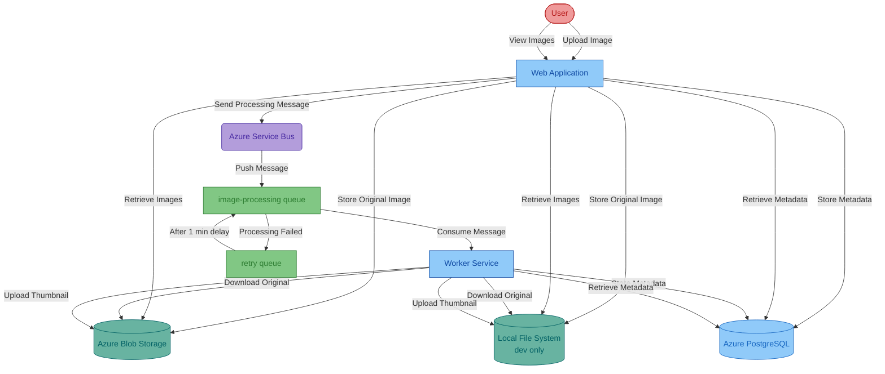
Managed identity based authentication

## Prerequisites

To successfully complete this workshop, you need the following:

- [VSCode](https://code.visualstudio.com/): The latest version is recommended.
- [A Github account with Github Copilot enabled](https://github.com/features/copilot): All plans are supported, including the Free plan.
- [GitHub Copilot extension in VSCode](https://code.visualstudio.com/docs/copilot/overview): The latest version is recommended.
- [GitHub Copilot app modernization for Java Extension](https://marketplace.visualstudio.com/items?itemName=vscjava.migrate-java-to-azure): The extension needed for migration
- [AppCAT](https://aka.ms/appcat-install): Required for the app assessment feature.
- [JDK 21](https://learn.microsoft.com/en-us/java/openjdk/download#openjdk-21): Required for the code remediation feature and running the initial application locally.
- [Maven 3.9.9](https://maven.apache.org/install.html): Required for the assessment and code remediation feature.
- [Azure subscription](https://azure.microsoft.com/free/): Required if you want to deploy the migrated application to Azure.
- [Azure CLI](https://docs.microsoft.com/cli/azure/install-azure-cli): Required if you want to deploy the migrated application to Azure locally. The latest version is recommended.

## Lab: Migrate the Sample Java Application

The following sections guide you through the process of migrating the sample Java application `asset-manager` to Azure using GitHub Copilot App Modernization for Java (Preview).

### Assess Your Java Application

The first step is to assess the sample Java application `asset-manager`. The assessment provides insights into the application's readiness for migration to Azure.

1. Open the VS code with all the prerequisites installed on the asset manager by changing the directory to the `asset-manager` directory and running `code .` in that directory.
2. Open the extension `GitHub Copilot App Modernization for Java`.
3. Hover the mouse over the **Assessment** section and click **Assess** button which looks like a triangle pointing right. Then, the Github Copilot Chat window will be opened and propose to run Modernization Assessor. Please confirm the tool usage by clicking **Continue**.
   
   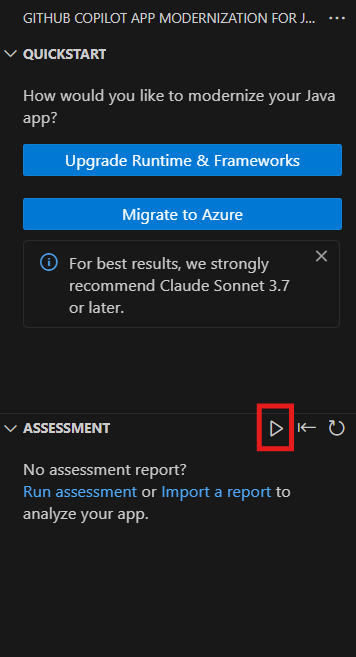

   > **NOTE**: If you are asked to allow the tool access the language models provided by GitHub Copilot Chat, select **Allow** to proceed.

4. After each step, please manually input "continue" to confirm and proceed.
5. App Mod will then run a precheck asessment to see if **AppCAT** is installed:
   
   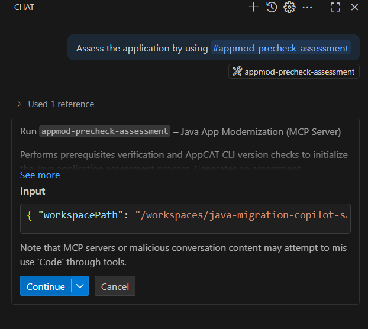
  > **NOTE**: AppCAT should be installed already using the devcontainer.

6. App Mod will try to install appcat eventually to make sure it's in the right place
    
    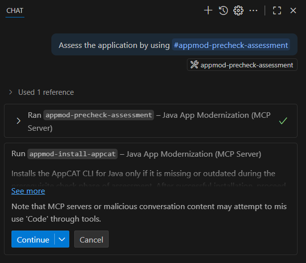

7. It will start the assessment after all prechecks and install have been completed.

    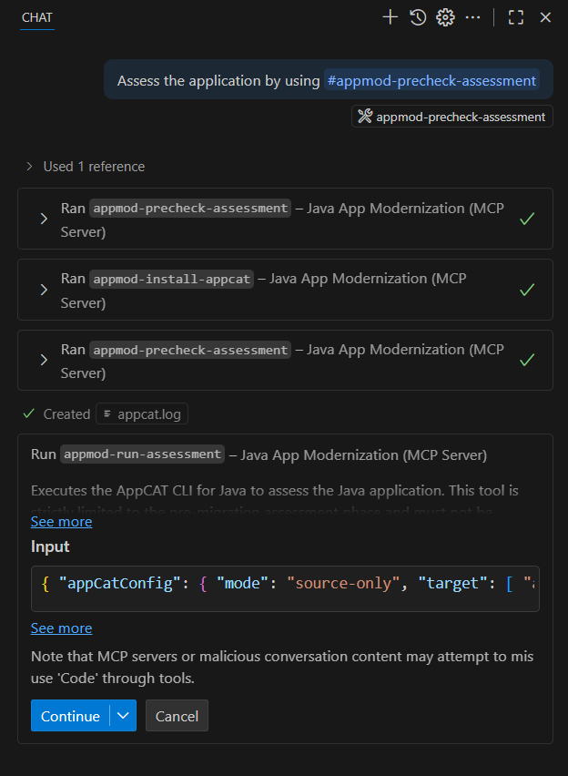

    > **NOTE**: You can click on the arrow dropdown next to **Running appmod-run-asessment* to view the params that are sent to the MCP server.
    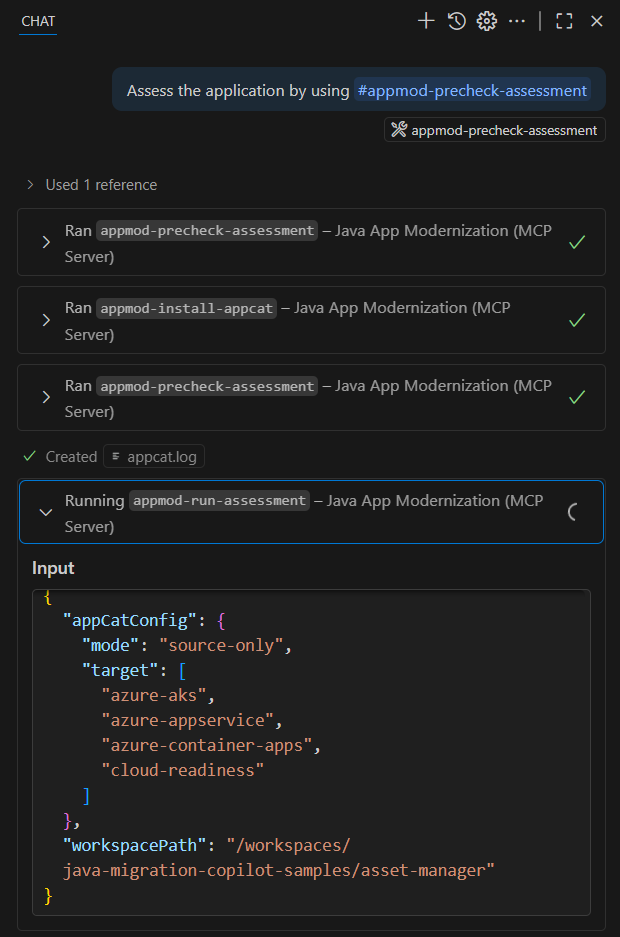
8. Wait for the assessment to be completed and the report to be generated.

    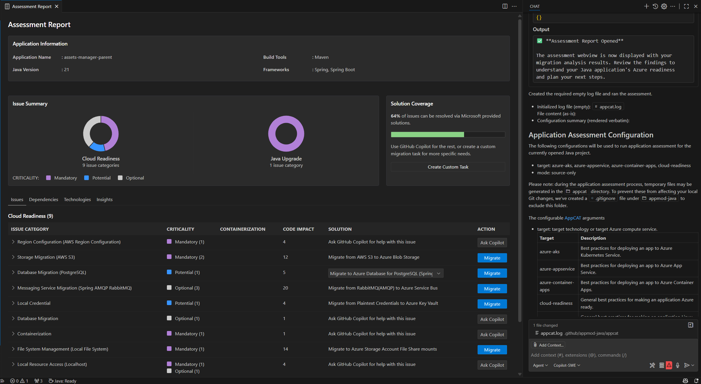

9. Review the **Summary** report. Take a look at the **Cloud Readiness** report under the **Issues** tab to view the proposed solutions for the issues identified in the summary report.

### Migrate to Azure Database for PostgreSQL Flexible Server

1. For this workshop, we will start with the **Database Migration**. 
Select **Migrate to Azure Database for PostgreSQL (SDK on Public Cloud)** in the Solution report dropdown on the right.

   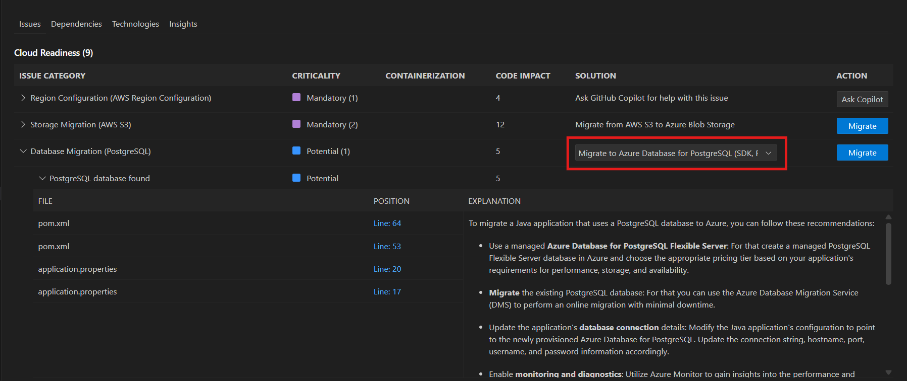

1. Right next to the Dropdown, click **Migrate**.
1. After clicking the Migrate button in the Solution Report, Copilot chat window will be opened with Agent Mode.
1. You should see GitHub Copilot run `#appmod-run-task by kbId: managed-identity-azure-sdk-public-cloud/mi-postgresql-azure-sdk-public-cloud`

    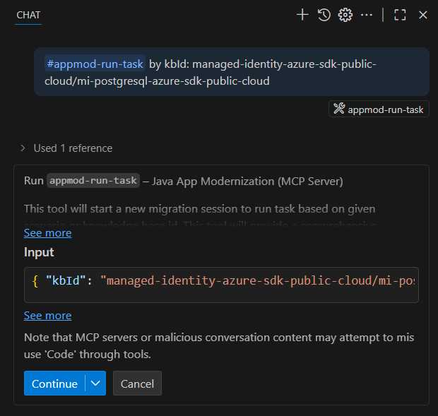

1. GHCP will continue to run `appmod-run-task`, `appmod-fetch-knowledgebase`,`appmod-search-file` and other tasks using the MCP Server. During each step, please manually click **Continue** repeatedly to allow, confirm and proceed. The Copilot Agent uses various tools to facilitate application modernization. Each tool's usage requires confirmation by clicking the `Continue` button.
1. Wait for the tasks to complete and a **progress overview** will show up as well as a **migration plan** inside GitHub Copilot Chat. Durch each step, please manually input or click "confirm" or "continue" to confirm and proceed. You can find these files under `.github/appmod-java/code-migration/managed-identity-azure-sdk-public-cloud/progress.md`.

      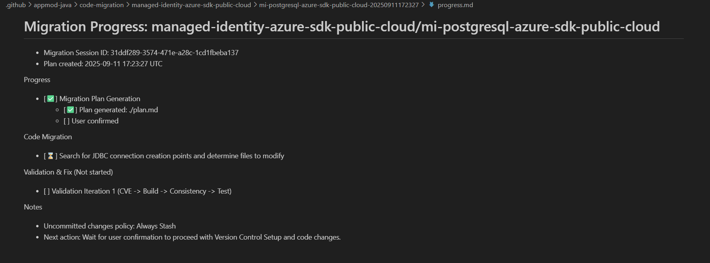

1. Click **Continue** to confirm to run **Java Application Build-Fix** tool. This tool will attempt to resolve any build errors, in up to 10 iterations.
1. After the Build-Fix tool begins, click **Continue** to proceed and show progress and migration summary.
1. Review the proposed code changes and click **Keep** to apply them.

      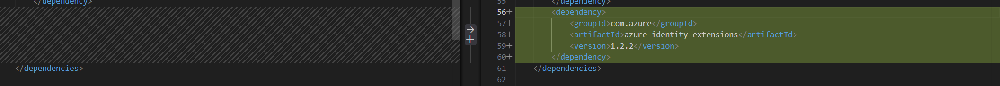
      
      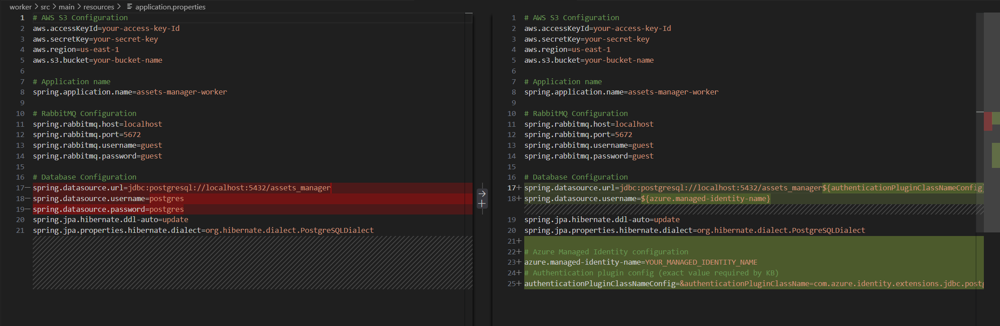
1. GHCP will continue to run `appmod-consistency-validation`. **Continue** and **Confirm** until it runs `appmod-create-migration-summary`.
1. Once GitHub Copilot provides oyu with next recommended actions after the **Summary** has been generated, this part of the lab is concluded.
1. Take a look at the **summary.md** file to review the changes. `.github/appmod-java/code-migration/managed-identity-azure-sdk-public-cloud/mi-postgresql-azure-sdk-public-cloud/summary.md`

### Migrate from AWS S3 to Azure Blob Storage

The Application `asset-manager` uses AWS S3 for image storage. Let's move to Azure Blob Storage instead.

1. Open the Assessment Report. You can always find it by opening the GitHub Copilot App Modernization for Java Extension and look under Assessment.
1. For this part of the workshop, we will take a look at the **Storage Migration**. 
We will **Migrate from AWS S3 to Azure Blob Storage**.

      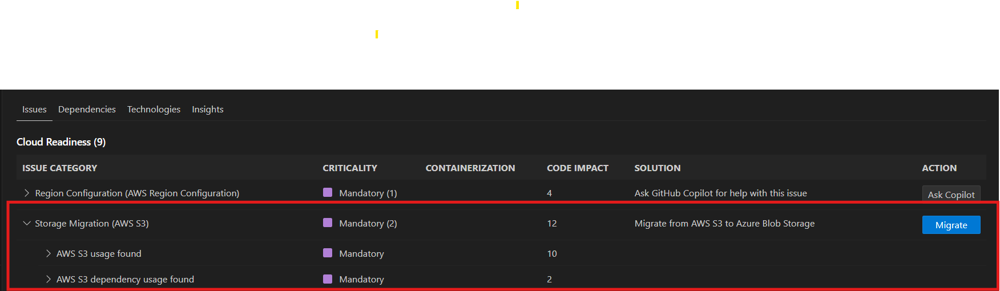
1. Click **Migrate**.
1. GitHub Copilot runs `#appmod-run-task by kbId: s3-to-azure-blob-storage`
1. GHCP will continue to run `appmod-run-task`, `appmod-fetch-knowledgebase`,`appmod-search-file` and other tasks using the MCP Server. During each step, please manually click **Continue** repeatedly to allow, confirm and proceed. The Copilot Agent uses various tools to facilitate application modernization. Each tool's usage requires confirmation by clicking the `Continue` button.
1. Review the proposed code changes and click **Keep** to apply them.

   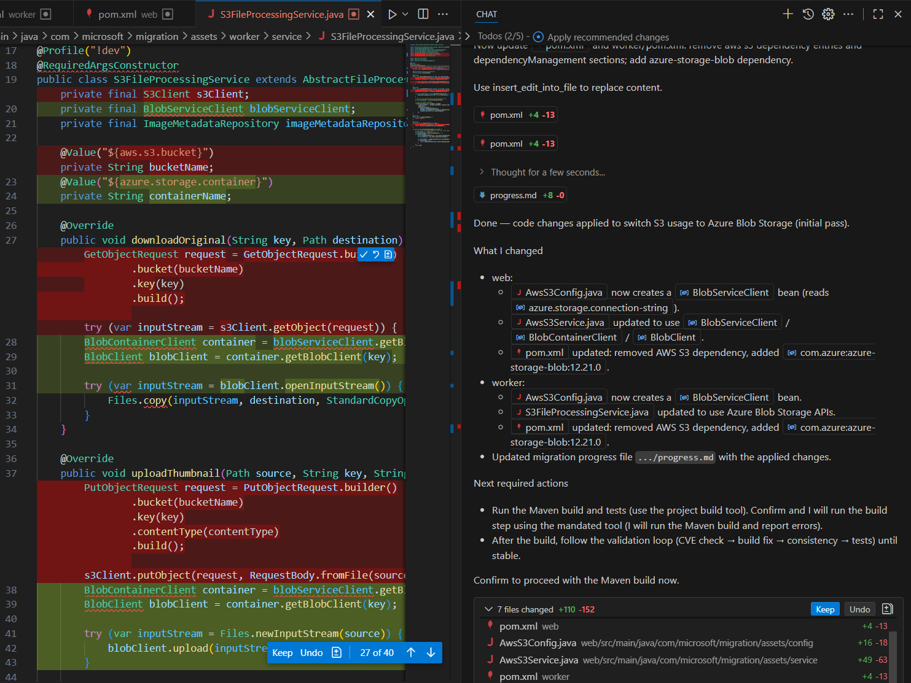

### Migrate from AMQP RabbitMQ to Azure Service Bus
The Application `asset-manager` uses Spring AMQP with RabbitMQ for message queuing.  Let's move to Azure Service Bus instead.

1. For this part of the workshop, we will take a look at the **Messaging Service Migration**. 
We will **Migrate from AMQP RabbitMQ to Azure Service Bus**.

      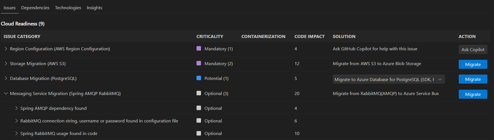
1. Click **Migrate**.
1. GitHub Copilot runs `#appmod-run-task by kbId: amqp-rabbitmq-servicebus`
1. GHCP will continue to run `appmod-run-task`, `appmod-fetch-knowledgebase`,`appmod-search-file` and other tasks using the MCP Server. During each step, please manually click **Continue** repeatedly to allow, confirm and proceed. The Copilot Agent uses various tools to facilitate application modernization. Each tool's usage requires confirmation by clicking the `Continue` button.
1. Review the proposed code changes and click **Keep** to apply them.

### Completion

Congratulations — you completed the lab!

- You ran an automated assessment and applied Copilot-generated migrations for database, storage, and messaging.
- You reviewed and accepted the generated code changes and migration summary.

**Next steps**
- You are free to deploy the migrated application to Azure using the provided deployment scripts in the [main repo](https://github.com/Azure-Samples/java-migration-copilot-samples/tree/main/asset-manager/scripts):
 (`scripts\deploy-to-azure.cmd` or `scripts/deploy-to-azure.sh`).
- Explore the `expected` branch to compare the final migrated state and learn from the changes.
- When finished, run the cleanup script to remove Azure resources (`scripts\cleanup-azure-resources.cmd` or `scripts/cleanup-azure-resources.sh`).

**Resources**
- Review `.github/appmod-java/.../summary.md` and `plan.md` for migration details.
- See the References & resources section above for SDK and CLI documentation.

**Well done!**
We hope this lab improved your confidence with App Modernization for Java and Azure migrations.

### Manual Verification & Checkpoints:
After each major step you can run for build checks:
`
mvn -f web/ clean package
mvn -f worker/ clean package
`

### Trouble Shooting

#### GHCP seems to be doing something unclear
Go and take a look at `.github/appmod-java/code-migration/managed-identity-azure-sdk-public-cloud/progress.md` and `.github/appmod-java/code-migration/managed-identity-azure-sdk-public-cloud/plan.md`. 
You will find the **Migration Session ID** in `plan.md` which you can always use to refer to the current migration plan. 

## References & resources
- [GitHub Copilot App Modernization for Java](https://marketplace.visualstudio.com/items?itemName=vscjava.migrate-java-to-azure)
- [Azure CLI docs](https://learn.microsoft.com/cli/azure/)
- [Azure Database for PostgreSQL](https://learn.microsoft.com/en-us/azure/postgresql/)
- [Azure Blob Storage SDK for Java](https://learn.microsoft.com/en-us/azure/storage/blobs/storage-blob-java-get-started?tabs=azure-ad)
- [Azure Service Bus SDK for Java](https://learn.microsoft.com/en-us/azure/service-bus-messaging/service-bus-java-how-to-use-queues?tabs=passwordless)

