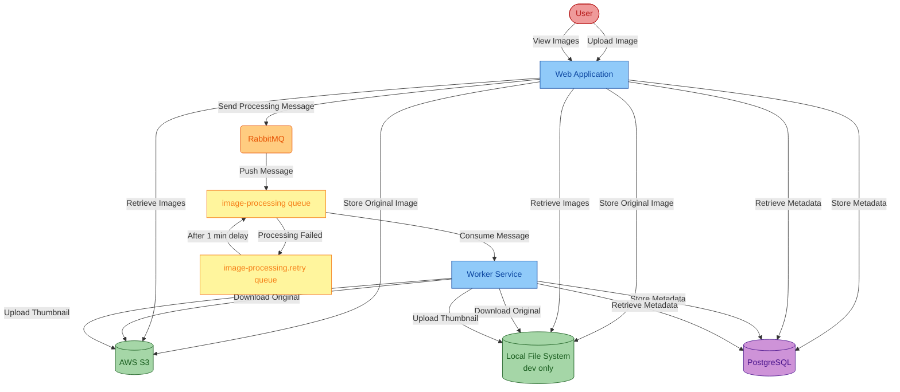

# Workshop: migrate this project to Azure

- [Workshop: migrate this project to Azure](#workshop-migrate-this-project-to-azure)
  - [About this Project](#about-this-project)
    - [Original Infrastructure](#original-infrastructure)
    - [Original Architecture](#original-architecture)
    - [Migrated Infrastructure](#migrated-infrastructure)
    - [Migrated Architecture](#migrated-architecture)
  - [Prerequisites](#prerequisites)
  - [Install GitHub Copilot App Modernization for Java (Preview)](#install-github-copilot-app-modernization-for-java-preview)
  - [Migrate the Sample Java Application](#migrate-the-sample-java-application)
    - [Assess Your Java Application](#assess-your-java-application)
    - [Migrate to Azure Database for PostgreSQL Flexible Server using Predefined Formula](#migrate-to-azure-database-for-postgresql-flexible-server-using-predefined-formula)
    - [Migrate to Azure Blob Storage and Azure Service Bus using Custom Formula](#migrate-to-azure-blob-storage-and-azure-service-bus-using-custom-formula)
  - [Deploy to Azure](#deploy-to-azure)
  - [Clean up](#clean-up)

> [!IMPORTANT]
> `GitHub Copilot App Modernization for Java` is in preview and is subject to change before becoming generally available.

GitHub Copilot App Modernization for Java (Preview), also referred to as `App Modernization for Java`, assists with app assessment, planning and code remediation. It automates repetitive tasks, boosting developer confidence and speeding up the Azure migration and ongoing optimization.

In this workshop, you learn how to use GitHub Copilot App Modernization for Java (Preview) to assess and migrate a sample Java application `asset-manager` to Azure.

## About this Project

This application consists of two sub-modules, **Web** and **Worker**.  Both of them contain functions of using storage service and message queue. To demonstrate the migration process, this GitHub repository is mainly composed of 3 different branches:

- [`source`](https://github.com/Azure-Samples/java-migration-copilot-samples/tree/source/asset-manager) branch: The original project before being migrated to Azure service.
- [`main`](https://github.com/Azure-Samples/java-migration-copilot-samples/tree/main/asset-manager) branch: Only the `web` module is migrated to use Azure service. This branch will be used for the workshop.
- [`expected`](https://github.com/Azure-Samples/java-migration-copilot-samples/tree/expected/asset-manager) branch: The is the final migrated state, and both `web` and `worker` modules are migrated to Azure.

### Original Infrastructure

The project uses the following infrastructure, in [`source`](https://github.com/Azure-Samples/java-migration-copilot-samples/tree/source/asset-manager) branch:

* AWS S3 for image storage, using password-based authentication (access key/secret key)
* RabbitMQ for message queuing, using password-based authentication
* PostgreSQL database for metadata storage, using password-based authentication

### Original Architecture


Password-based authentication

### Migrated Infrastructure

After migration, the project will use the following Azure services, in [`expected`](https://github.com/Azure-Samples/java-migration-copilot-samples/tree/expected/asset-manager) branch:

* Azure Blob Storage for image storage, using managed identity authentication
* Azure Service Bus for message queuing, using managed identity authentication
* Azure Database for PostgreSQL for metadata storage, using managed identity authentication

### Migrated Architecture


Managed identity based authentication

## Prerequisites

To successfully complete this workshop, you need the following:

- [VSCode](https://code.visualstudio.com/): The latest version is recommended.
- [A Github account with Github Copilot enabled](https://github.com/features/copilot): All plans are supported, including the Free plan.
- [GitHub Copilot extension in VSCode](https://code.visualstudio.com/docs/copilot/overview): The latest version is recommended.
- [AppCAT](https://aka.ms/appcat-install): Required for the app assessment feature.
- [JDK 21](https://learn.microsoft.com/en-us/java/openjdk/download#openjdk-21): Required for the code remediation feature and running the initial application locally.
- [Maven 3.9.9](https://maven.apache.org/install.html): Required for the assessment and code remediation feature.
- [Azure subscription](https://azure.microsoft.com/free/): Required to deploy the migrated application to Azure.
- [Azure CLI](https://docs.microsoft.com/cli/azure/install-azure-cli): Required if you deploy the migrated application to Azure locally. The latest version is recommended.
- Fork the [GitHub repository](https://github.com/Azure-Samples/java-migration-copilot-samples) that contains the sample Java application. Please ensure to **uncheck** the default selection "Copy the `main` branch only". Clone it to your local machine. Open the `asset-manager` folder in VSCode and checkout the `main` branch.

## Install GitHub Copilot App Modernization for Java (Preview)

In VSCode, open the Extensions view from Activity Bar, search `GitHub Copilot App Modernization for Java` extension in marketplace. Select the Install button on the extension. After installation completes, you should see a notification in the bottom-right corner of VSCode confirming success.

In VSCode, configure runtime arguments to enable the proposed API:
```json
  "enable-proposed-api": ["Microsoft.migrate-java-to-azure"],
```
1. Press **Ctrl+Shift+P** and select **Preferences: Configure Runtime Arguments**.
2. Add the above JSON snippet into the editor and save.
3. Restart VSCode.


## Migrate the Sample Java Application

The following sections guide you through the process of migrating the sample Java application `asset-manager` to Azure using GitHub Copilot App Modernization for Java (Preview).

### Assess Your Java Application

The first step is to assess the sample Java application `asset-manager`. The assessment provides insights into the application's readiness for migration to Azure.

1. Open the VS code with all the prerequisites installed on the asset manager by changing the directory to the `asset-manager` directory and running `code .` in that directory.
2. Open the extension `App Modernization for Java`.
3. Hover the mouse over the **Assessment** section and click **Assess** button which looks like a triangle pointing right. Then, the Github Copilot Chat window will be opened and propose to run Modernization Assessor. Please confirm the tool usage by clicking **Continue**.
   
   

   > **NOTE**: If you are asked to allow the tool access the language models provided by GitHub Copilot Chat, select **Allow** to proceed.

4. After each step, please manually input "continue" to confirm and proceed.
5. App Mod will then run a precheck asessment to see if **AppCAT** is installed:
   
   
  > **NOTE**: AppCAT should be installed already using the devcontainer.

6. App Mod will try to install appcat eventually to make sure it's in the right place
    
    

7. It will start the assessment after all prechecks and install have been completed.

    

    > **NOTE**: You can click on the arrow dropdown next to **Running appmod-run-asessment* to view the params that are sent to the MCP server.
    
8. Wait for the assessment to be completed and the report to be generated.

    

9. Review the **Summary** report. Take a look at the **Cloud Readiness** report under the **Issues** tab to view the proposed solutions for the issues identified in the summary report.

## Migrate to Azure Database for PostgreSQL Flexible Server

1. For this workshop, we will start with the **Database Migration**. 
Select **Migrate to Azure Database for PostgreSQL (SDK on Public Cloud)** in the Solution report dropdown on the right.

   

1. Right next to the Dropdown, click **Migrate**.
1. After clicking the Migrate button in the Solution Report, Copilot chat window will be opened with Agent Mode.
1. You should see GitHub Copilot run `#appmod-run-task by kbId: managed-identity-azure-sdk-public-cloud/mi-postgresql-azure-sdk-public-cloud`

    

1. GHCP will continue to run `appmod-run-task`, `appmod-fetch-knowledgebase`,`appmod-search-file` and other tasks using the MCP Server. During each step, please manually click **Continue** repeatedly to allow, confirm and proceed. The Copilot Agent uses various tools to facilitate application modernization. Each tool's usage requires confirmation by clicking the `Continue` button.
1. Wait for the tasks to complete and a **progress overview** will show up as well as a **migration plan** inside GitHub Copilot Chat. Durch each step, please manually input or click "confirm" or "continue" to confirm and proceed. You can find these files under `.github/appmod-java/code-migration/managed-identity-azure-sdk-public-cloud/progress.md`.


      

1. Click **Continue** to confirm to run **Java Application Build-Fix** tool. This tool will attempt to resolve any build errors, in up to 10 iterations.
1. After the Build-Fix tool begins, click **Continue** to proceed and show progress and migration summary.
1. Review the proposed code changes and click **Keep** to apply them.

      
      
      
1. GHCP will continue to run `appmod-consistency-validation`. **Continue** and **Confirm** until it runs `appmod-create-migration-summary`.
1. Once GitHub Copilot provides oyu with next recommended actions after the **Summary** has been generated, this part of the lab is concluded.
1. Take a look at the **summary.md** file to review the changes. `.github/appmod-java/code-migration/managed-identity-azure-sdk-public-cloud/mi-postgresql-azure-sdk-public-cloud/summary.md`

## Migrate from AWS S3 to Azure Blob Storage

The Application `asset-manager` uses AWS S3 for image storage. Let's move to Azure Blob Storage instead.

1. Open the Assessment Report. You can always find it by opening the GitHub Copilot App Modernization for Java Extension and look under Assessment.
1. For this part of the workshop, we will take a look at the **Storage Migration**. 
We will **Migrate from AWS S3 to Azure Blob Storage**.

      
1. Click **Migrate**.
1. GitHub Copilot runs `#appmod-run-task by kbId: s3-to-azure-blob-storage`
1. GHCP will continue to run `appmod-run-task`, `appmod-fetch-knowledgebase`,`appmod-search-file` and other tasks using the MCP Server. During each step, please manually click **Continue** repeatedly to allow, confirm and proceed. The Copilot Agent uses various tools to facilitate application modernization. Each tool's usage requires confirmation by clicking the `Continue` button.
1. Review the proposed code changes and click **Keep** to apply them.

   

## Migrate from AMQP RabbitMQ to Azure Service Bus
The Application `asset-manager` uses Spring AMQP with RabbitMQ for message queuing.  Let's move to Azure Service Bus instead.

1. For this part of the workshop, we will take a look at the **Messaging Service Migration**. 
We will **Migrate from AMQP RabbitMQ to Azure Service Bus**.

      
1. Click **Migrate**.
1. GitHub Copilot runs `#appmod-run-task by kbId: amqp-rabbitmq-servicebus`
1. GHCP will continue to run `appmod-run-task`, `appmod-fetch-knowledgebase`,`appmod-search-file` and other tasks using the MCP Server. During each step, please manually click **Continue** repeatedly to allow, confirm and proceed. The Copilot Agent uses various tools to facilitate application modernization. Each tool's usage requires confirmation by clicking the `Continue` button.
1. Review the proposed code changes and click **Keep** to apply them.

## Deploy to Azure
At this point, you have successfully migrated the sample Java application `asset-manager` to Migrate to Azure Database for PostgreSQL (SDK on Public Cloud), Azure Blob Storage, and Azure Service Bus. 

> The Lab is over.

Now you are free to can deploy the migrated application to Azure using the Azure CLI after you identify a working location for your Azure resources.

For example, an Azure Database for PostgreSQL Flexible Server requires a location that supports the service. Follow the instructions below to find a suitable location.

1. Run the following command to list all available locations for the current subscription.

   ```bash
   az account list-locations -o table
   ```

1. Select a location from column **Name** in the output.

1. Run the following command to list all available SKUs in the selected location for Azure Database for PostgreSQL Flexible Server:

   ```bash
   az postgres flexible-server list-skus --location <your location> -o table
   ```

1. If you see the output contains the SKU `Standard_B1ms` and the **Tier** is `Burstable`, you can use the location for the deployment. Otherwise, try another location.

   ```text
   SKU                Tier             VCore    Memory    Max Disk IOPS
   -----------------  ---------------  -------  --------  ---------------
   Standard_B1ms      Burstable        1        2 GiB     640e
   ```

You can either run the deployment script locally or use the GitHub Codespaces. The recommended approach is to run the deployment script in the GitHub Codespaces, as it provides a ready-to-use environment with all the necessary dependencies.

Deploy using GitHub Codespaces:
1. Commit and push the changes to your forked repository.
1. Follow instructions in [Use GitHub Codespaces for Deployment](README.md#use-github-codespaces-for-deployment) to deploy the app to Azure.

Deploy using local environment by running the deployment script in the terminal:
1. Run `az login` to sign in to Azure.
1. Run the following commands to deploy the app to Azure:

   Windows:
   ```batch
   scripts\deploy-to-azure.cmd -ResourceGroupName <your resource group name> -Location <your resource group location, e.g., eastus2> -Prefix <your unique resource prefix>
   ```

   Linux:
   ```bash
   scripts/deploy-to-azure.sh -ResourceGroupName <your resource group name> -Location <your resource group location, e.g., eastus2> -Prefix <your unique resource prefix>
   ```

Once the deployment script completes successfully, it outputs the URL of the Web application. Open the URL in a browser to verify if the application is running as expected.

## Clean up

When no longer needed,  you can delete all related resources using the following scripts.

Windows:
```batch
scripts\cleanup-azure-resources.cmd -ResourceGroupName <your resource group name>
```

Linux:
```bash
scripts/cleanup-azure-resources.sh -ResourceGroupName <your resource group name>
```

If you deploy the app using GitHub Codespaces, delete the Codespaces environment by navigating to your forked repository in GitHub and selecting **Code** > **Codespaces** > **Delete**.


# Trouble Shooting

## GHCP seems to be doing something weird
Go and take a look at `.github/appmod-java/code-migration/managed-identity-azure-sdk-public-cloud/progress.md` and `.github/appmod-java/code-migration/managed-identity-azure-sdk-public-cloud/plan.md`. You will find the **Migration Session ID** in `plan.md` which you can always use to refer to the current migration plan. 